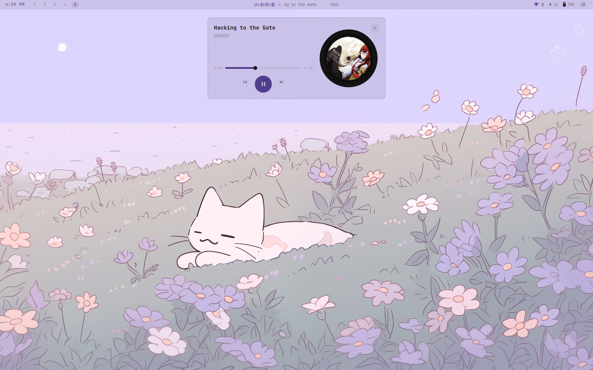
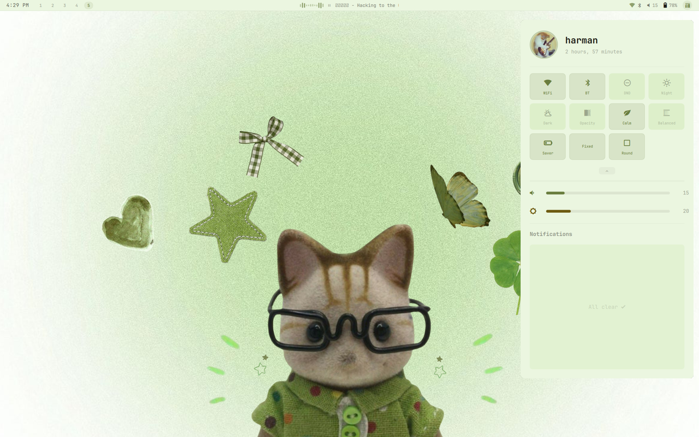
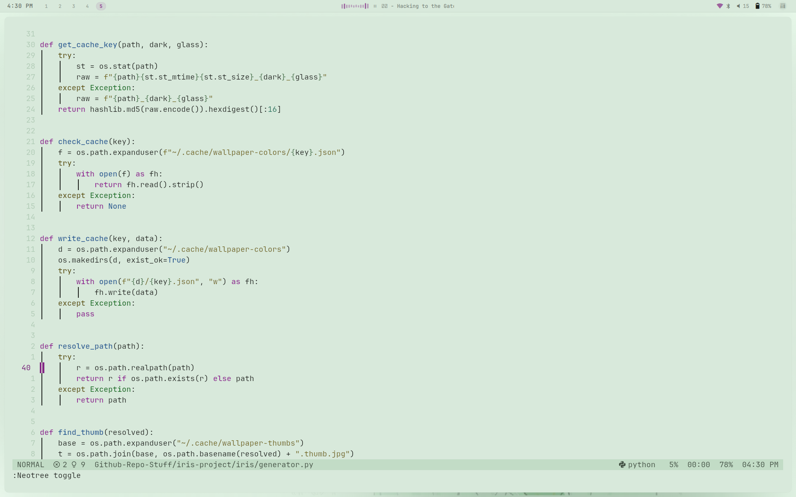
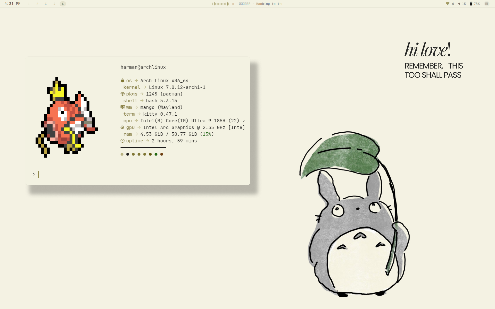
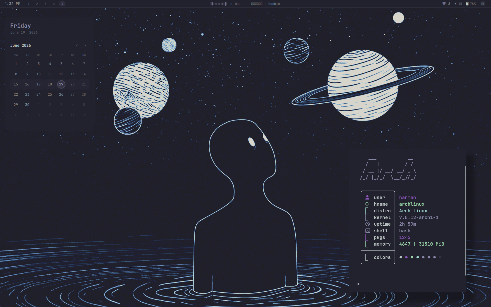
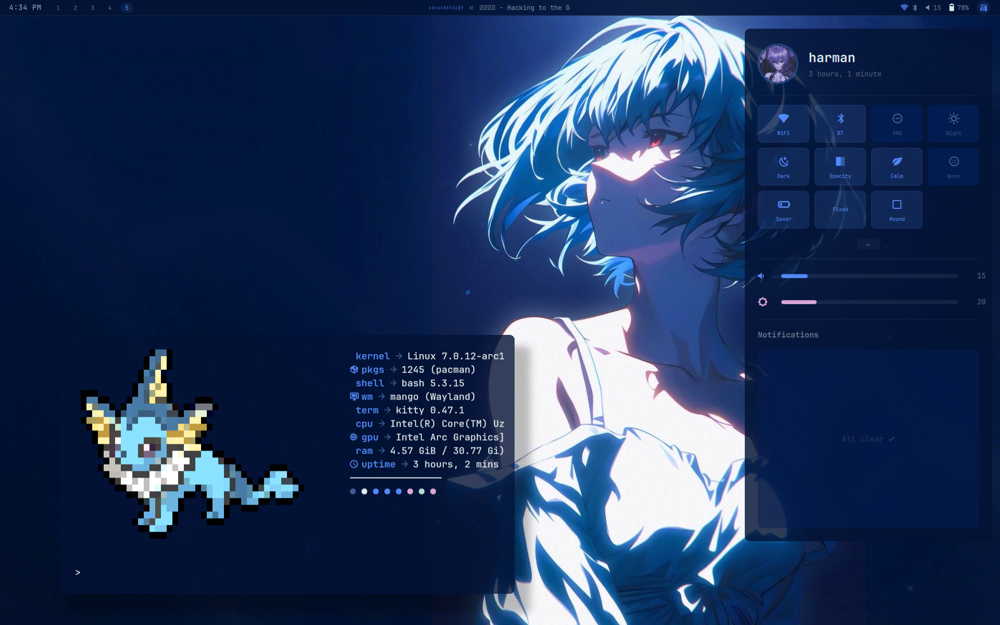

# iris

A color scheme generator for Linux ricing. Like pywal or matugen, but with semantic colors.

## Why this exists

Most color generators look terrible on light wallpapers, especially pastel ones. They either wash out completely or generate colors with no saturation. pywal tends to extract muddy browns from soft pink/blue wallpapers. matugen does better but still skews everything toward Material You's specific aesthetic.

iris handles pastels differently. It preserves the hue from the wallpaper but boosts saturation for UI elements while keeping the background soft. Light mode actually gets proper contrast (7:1 for text) instead of the barely-readable gray-on-white you get elsewhere.

Also, I don't like pure black backgrounds (#000000) or pure white (#ffffff) unless the wallpaper is literally a black or white image. Most wallpapers have some color in them, even if it's subtle. iris detects when a wallpaper is actually pure black/white (checks if >45% of pixels are near 0 or 255 lightness) and only then gives you true black/white. Otherwise it tints the background slightly toward the wallpaper's dominant hue. Feels more cohesive.

The algorithm uses LAB color space instead of RGB for clustering, which means it picks colors based on how humans actually perceive them. It weights pixels by spatial position (center of the image matters more than edges). It checks contrast ratios for accessibility. It generates syntax highlighting colors by rotating around the hue wheel instead of just dumping whatever the wallpaper happened to have.

Works pretty well on most wallpapers. Some extract weird colors, that's just how it is. Complex gradients or wallpapers with 10 competing colors confuse the clustering. If you get a bad palette, try forcing dark or light mode, or just use a different wallpaper.

---

## Screenshots


---

---

---

---

---


---

## Installation

### From source

```bash
git clone https://github.com/Harman1307/iris
cd iris
pip install .
```

### From the AUR

```bash
yay -S iris-colors
```

## Usage

```bash
iris ~/wallpapers/mountain.jpg
```

That's it. Colors get written to `~/.cache/iris/`.

Force dark or light mode:
```bash
iris ~/wallpapers/mountain.jpg --dark 1
iris ~/wallpapers/mountain.jpg --dark 0
```

---

## Applying colors

### Terminal (any terminal emulator)

Add this to your `~/.bashrc` or `~/.zshrc`:

```bash
cat ~/.cache/iris/sequences
```

This themes your terminal immediately. Works in kitty, alacritty, foot, whatever.

### Shell scripts

```bash
source ~/.cache/iris/colors.sh

echo "Background: $bg"
echo "Accent: $accent"
```

### Kitty

```bash
ln -sf ~/.cache/iris/colors-kitty.conf ~/.config/kitty/current-theme.conf
```

Then in your `kitty.conf`:
```
include current-theme.conf
```

### Hyprland

In your `hyprland.conf`:
```
source = ~/.cache/iris/colors-hypr.conf
```

Then use the colors:
```
general {
    col.active_border = $accent
    col.inactive_border = $surface
}
```

### Waybar

In your `style.css`:
```css
@import "~/.cache/iris/colors-waybar.css";
```

---

## Custom templates

Put templates in `~/.config/iris/templates/`.

Example `~/.config/iris/templates/rofi.rasi`:
```
* {
    bg: {bg};
    fg: {fg};
    accent: {accent};
}
```

After running iris, the output shows up in `~/.cache/iris/rofi.rasi`.

You can use any color variable: `{bg}`, `{fg}`, `{accent}`, `{red}`, `{green}`, `{yellow}`, `{surface}`, `{dim}`, or terminal colors `{color0}` through `{color15}`.

Also works: `{bg.rgb}` for `r, g, b` format and `{bg.strip}` for hex without the `#`.

---

## Migrating from pywal

```bash
iris ~/wallpaper.jpg --compat wal
```

This writes everything to `~/.cache/wal/` so your existing configs keep working. You don't have to change a single line in your dotfiles.

Once you're ready, gradually switch to iris's native paths.

---

## What colors you get

**Semantic colors:**
- `bg` — background
- `fg` — foreground  
- `surface` — slightly lighter/darker than bg (for cards, panels)
- `dim` — dimmed text
- `accent` — primary accent color
- `red`, `green`, `yellow` — semantic colors

**Syntax highlighting:**
- `syntax_keyword`, `syntax_string`, `syntax_func`, `syntax_type`, `syntax_const`, `syntax_comment`, `syntax_param`, `syntax_operator`

**Terminal palette:**
- `color0` through `color15` — standard ANSI colors

Everything gets written to JSON, shell variables, CSS variables, and terminal escape sequences.

---

## How it actually works

1. Loads your wallpaper and downscales it to 150x150 (for speed)
2. Runs k-means clustering in LAB color space (14 clusters)
3. Weights clusters by spatial position (center matters more than edges)
4. Picks the most dominant cluster as the background
5. Finds the most saturated, visually distinct cluster for the accent
6. Generates foreground with contrast ratio checks (WCAG AA minimum)
7. Creates surface and dim colors as variations of bg and fg
8. Assigns red/green/yellow by finding clusters near those hues
9. Generates 8 syntax colors by rotating around the color wheel from bg hue
10. Caches everything so switching back to a wallpaper you've used is instant

Auto-detects dark/light mode based on average luminance and pixel distribution. You can override it with `--dark 1` or `--dark 0`.

---

## For Quickshell users

If you're already using iris with Quickshell , just add `--json-only`:

```qml
Process {
    command: [
        "iris",
        wallpaperPath,
        "--json-only",
        "--dark", darkMode ? "1" : "0"
    ]
    stdout: SplitParser {
        onRead: data => applyColors(JSON.parse(data))
    }
}
```

This skips writing files and only prints JSON. Your QML handles the rest.

---

## Known issues

- **Some wallpapers extract bad colors.** Complex gradients or competing dominant colors can confuse the clustering. If it looks weird, try a different wall or force dark/light mode.
  
- **Syntax colors might clash on grayscale wallpapers.** The algorithm injects hue where none exists. It's intentional (all-gray syntax highlighting sucks) but sometimes looks off.

- **First run is slower.** Pillow and numpy take a moment to load. Subsequent runs are fast because of caching.

---

## Files it writes

```
~/.cache/iris/
├── colors.json              # Full theme (your native format)
├── colors.sh                # Shell variables
├── colors.css               # CSS variables
├── sequences                # Terminal escape sequences
├── colors-kitty.conf        # Kitty theme
├── colors-hypr.conf         # Hyprland colors
├── colors-waybar.css        # Waybar colors
└── colors-wayle.toml        # Wayle colors

~/.cache/wallpaper-colors/
└── <hash>.json              # Cached colors per wallpaper
```

If you use `--compat wal`, it also writes to `~/.cache/wal/`.

---

## Credits

The algorithm is mine, but the idea of extracting colors from wallpapers obviously isn't new. Inspired by pywal, matugen, and every rice on r/unixporn that does live theming.

---

## License

MIT. Do whatever.

---
